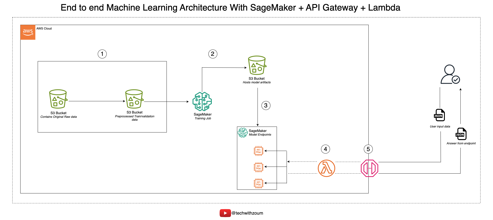

# End-to-End Machine Learning Architecture with AWS SageMaker, API Gateway, and Lambda

This repository contains the code and resources for implementing an end-to-end Machine Learning architecture using AWS services, including SageMaker, API Gateway, and Lambda.

## Architecture Overview

The architecture consists of the following components:

1. **Data Preparation**
   - S3 Bucket containing original raw data
   - S3 Bucket with preprocessed train/validation data

2. **Model Training**
   - SageMaker Training Job
   - S3 Bucket to host model artifacts

3. **Model Deployment**
   - SageMaker Model Endpoints

4. **API Integration**
   - AWS Lambda function
   - Amazon API Gateway

5. **User Interaction**
   - User input data (JSON)
   - Answer from endpoint (JSON)

## Repository Contents

- `document_text_classification.ipynb`: Jupyter notebook for document text classification
- `lambda_function.py`: Python script for AWS Lambda function
- `my_config.py`: Configuration file
- `tech_wit_zoum_MLOps.png`: Architecture diagram

## Implementation Steps

1. **Data Preparation**
   - Store original raw data in an S3 bucket
   - Preprocess the data and store train/validation datasets in another S3 bucket

2. **Model Training**
   - Use SageMaker to create a training job
   - Train the model using the preprocessed data
   - Store the model artifacts in an S3 bucket

3. **Model Deployment**
   - Deploy the trained model to SageMaker endpoints

4. **API Integration**
   - Create a Lambda function to interact with the SageMaker endpoint
   - Set up an API Gateway to expose the Lambda function

5. **User Interaction**
   - Users can send input data in JSON format through the API
   - The system processes the input and returns the model's prediction

## Usage

1. Clone this repository
2. Follow the steps in the `document_text_classification.ipynb` notebook to train and deploy your model
3. Configure the Lambda function using `lambda_function.py`
4. Set up the API Gateway to trigger the Lambda function
5. Use the API to interact with your deployed model

## Configuration

Adjust the `my_config.py` file to set up your AWS credentials and other configuration parameters.

## License

[Include your license information here]

## Contact

For more information, visit [@techwithzoum](https://youtube.com/@techwithzoum) on YouTube.
